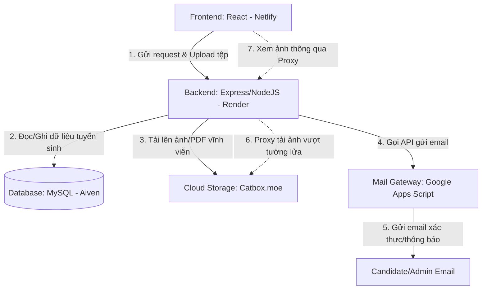
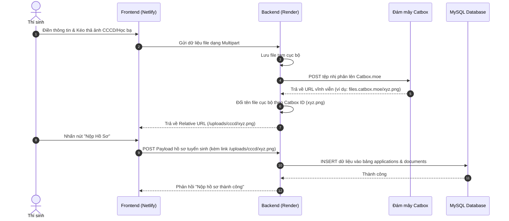

# Hướng Dẫn Triển Khai Hệ Thống (Deployment & Integration Guide)

Tài liệu này cung cấp cái nhìn chi tiết về kiến trúc hệ thống, sự phối hợp giữa các công cụ, luồng hoạt động thực tế và các bước triển khai chi tiết từ đầu đến cuối cho hệ thống Tuyển sinh xét tuyển học bạ THPT trực tuyến.

---

## 1. Kiến Trúc Hệ Thống & Sự Phối Hợp Giữa Các Công Cụ

Hệ thống được thiết kế theo mô hình Client-Server hiện đại, tận dụng các dịch vụ đám mây miễn phí chất lượng cao để vượt qua các hạn chế về lưu trữ tạm thời (ephemeral storage) và rào cản cổng SMTP của nhà mạng.



### Cách thức các công cụ phối hợp:
1. **Frontend (React + Vite + Ant Design) — Triển khai trên Netlify:**
   - Đảm nhận vai trò giao diện người dùng (Candidate & Admin layouts).
   - Thực hiện giao tiếp với Backend qua RESTful API bằng thư viện `Axios` (được cấu hình thời gian chờ 60 giây để xử lý file lớn).
   - Tải lên tài liệu minh chứng trực tiếp thông qua bộ kéo thả `Dragger` của Ant Design.

2. **Backend (Node.js + Express + Sequelize ORM) — Triển khai trên Render:**
   - Xử lý nghiệp vụ logic, xác thực JWT, phân quyền (Candidate/Admin) và điều phối tài nguyên.
   - Nhờ cơ chế **Auto Schema Fix**, khi server khởi chạy lần đầu tiên trên Render, nó tự động kiểm tra và thêm các cột còn thiếu trong DB mà không cần chạy file SQL thủ công.

3. **Cơ sở dữ liệu (MySQL) — Triển khai trên Aiven:**
   - Lưu trữ toàn bộ dữ liệu có cấu trúc bao gồm thông tin tài khoản, thông tin hồ sơ cá nhân, lịch sử trạng thái hồ sơ, thông tin trường đại học, ngành học và danh mục tài liệu.

4. **Lưu trữ đám mây (Catbox.moe API Gateway):**
   - Đóng vai trò là bộ nhớ lưu trữ vĩnh viễn cho hình ảnh và tài liệu PDF. Khi thí sinh tải lên tài liệu, Backend lưu tạm thời, đẩy ngay lên Catbox nhận về ID tệp và đổi tên đồng bộ tệp tin cục bộ.
   - **Streaming Proxy:** Khi tệp cục bộ bị xóa do cơ chế xóa đĩa tạm thời của Render, Backend tự động tải tệp từ Catbox và stream dữ liệu nhị phân về trình duyệt. Cơ chế này giúp vượt qua hoàn toàn việc bị nhà mạng Việt Nam chặn truy cập trực tiếp trang Catbox.

5. **Bộ chuyển tiếp Email (Google Apps Script Gateway):**
   - Vượt qua rào cản chặn cổng SMTP (cổng 25, 465, 587) của máy chủ đám mây Render. Backend chỉ cần gửi một HTTPS POST yêu cầu đến Google Apps Script, script này sẽ sử dụng hệ thống hạ tầng Gmail của Google để gửi thư chính xác, nhanh chóng vào Inbox của người dùng.

---

## 2. Quy Trình Hoạt Động Thực Tế (Workflow)

### Luồng nộp hồ sơ xét tuyển:


### Luồng xem ảnh minh chứng qua Proxy (Tránh bị chặn mạng ISP):
1. **Yêu cầu:** Admin nhấp vào nút "Xem file minh chứng" của hồ sơ thí sinh.
2. **Frontend:** Gửi yêu cầu GET đến link `/uploads/cccd/xyz.png` trên Backend Render.
3. **Backend Middleware (`notFound.middleware.js`):**
   - Kiểm tra xem file `xyz.png` có tồn tại trên ổ đĩa tạm thời của Render không.
   - **Trường hợp 1 (File tồn tại):** Trả về file cục bộ ngay lập tức.
   - **Trường hợp 2 (File bị mất do Render restart):** Backend tự động tải ngầm file từ `https://files.catbox.moe/xyz.png`, thiết lập `Content-Type` chuẩn (`image/png` hoặc `application/pdf`) và stream dữ liệu trực tiếp về trình duyệt.
   - **Trường hợp 3 (Hồ sơ cũ không có file):** Trả về ảnh placeholder thông minh (định dạng PNG) tương ứng với từng loại danh mục (Avatar, CCCD, Học bạ...).

---

## 3. Các Bước Triển Khai Chi Tiết (Deployment Steps)

### Bước 1: Thiết lập Cơ sở dữ liệu MySQL trên Aiven
1. Truy cập [Aiven.io](https://aiven.io/), đăng ký tài khoản miễn phí.
2. Tạo mới một Service với cấu hình:
   - **Service type:** MySQL
   - **Cloud provider:** AWS hoặc Google Cloud (chọn khu vực gần Việt Nam như Singapore để tối ưu ping).
   - **Plan:** Free Tier.
3. Chờ dịch vụ khởi tạo xong, truy cập vào bảng điều khiển của dịch vụ lấy thông tin kết nối gồm: **Host, Port, User, Password, SSL CA Certificate**.

---

### Bước 2: Thiết lập Google Apps Script Email Gateway
1. Truy cập [Google Drive](https://drive.google.com/) bằng tài khoản Gmail của bạn.
2. Nhấn **Mới** -> **Ứng dụng khác** -> **Google Apps Script**.
3. Dán đoạn mã sau vào trình soạn thảo script:
   ```javascript
   function doPost(e) {
     try {
       var data = JSON.parse(e.postData.contents);
       MailApp.sendEmail({
         to: data.to,
         subject: data.subject,
         htmlBody: data.htmlBody
       });
       return ContentService.createTextOutput(JSON.stringify({ success: true }))
         .setMimeType(ContentService.MimeType.JSON);
     } catch (error) {
       return ContentService.createTextOutput(JSON.stringify({ success: false, error: error.toString() }))
         .setMimeType(ContentService.MimeType.JSON);
     }
   }
   ```
4. Nhấp **Triển khai (Deploy)** -> **Triển khai mới (New deployment)**.
5. Chọn loại cấu hình là **Ứng dụng web (Web app)**.
   - **Ai có quyền truy cập (Who has access):** Chọn **Mọi người (Anyone)**.
6. Nhấp **Triển khai**, cấp quyền truy cập tài khoản Gmail khi được yêu cầu.
7. Sao chép **URL ứng dụng web** được cấp (đây chính là URL để điền vào cấu hình Backend).

---

### Bước 3: Triển khai Backend lên Render
1. Đăng nhập vào [Render.com](https://render.com/).
2. Nhấp **New +** -> Chọn **Web Service**.
3. Kết nối với tài khoản GitHub của bạn và chọn Repository `RIPT1307-Nhom11-KTHP`.
4. Cấu hình các thông tin cơ bản:
   - **Name:** `tuyensinh-api` (hoặc tên tùy chọn)
   - **Language:** `Node`
   - **Root Directory:** `server`
   - **Build Command:** `npm install`
   - **Start Command:** `npm start`
5. Nhấp vào nút **Advanced** để thêm các biến môi trường (**Environment Variables**):
   | Tên biến | Giá trị mẫu | Ý nghĩa |
   | :--- | :--- | :--- |
   | `NODE_ENV` | `production` | Chế độ chạy ứng dụng |
   | `PORT` | `10000` | Cổng dịch vụ |
   | `DB_HOST` | `mysql-xxxx.aivencloud.com` | Host database lấy từ Aiven |
   | `DB_PORT` | `3306` (hoặc port của Aiven cấp) | Cổng database |
   | `DB_USER` | `avnadmin` | Tài khoản MySQL |
   | `DB_PASSWORD` | `mật_khẩu_aiven_cấp` | Mật khẩu MySQL |
   | `DB_NAME` | `defaultdb` (hoặc tên db của bạn) | Tên database |
   | `JWT_SECRET` | `chuỗi_bí_mật_ngẫu_nhiên_của_bạn` | Dùng để mã hóa token đăng nhập |
   | `CLIENT_URL` | `https://tuyensinh.netlify.app` | URL trang Frontend của bạn trên Netlify |
   | `GMAIL_APP_SCRIPT_URL` | `URL_Google_Apps_Script_ở_Bước_2` | Cổng gửi mail tự động |
6. Nhấp **Create Web Service** và chờ Render tiến hành build và khởi động. Khi thấy log báo `MySQL connected successfully` là kết nối thành công.

---

### Bước 4: Triển khai Frontend lên Netlify
1. Mở mã nguồn dự án tại máy tính cá nhân của bạn.
2. Truy cập vào thư mục `client` và mở file `.env.production` (hoặc tạo mới nếu chưa có) để cấu hình đường dẫn API trỏ đến Render:
   ```env
   VITE_API_URL=https://tuyensinh-api.onrender.com/api
   ```
   *(Thay thế đường dẫn trên bằng domain Render thực tế dịch vụ Backend của bạn).*
3. Mở Terminal tại thư mục `client` và chạy chuỗi lệnh đóng gói ứng dụng:
   ```powershell
   npm run setup
   npm run build
   ```
4. Khi quá trình đóng gói hoàn tất, một thư mục mới có tên là `dist` sẽ xuất hiện bên trong thư mục `client`.
5. Truy cập [Netlify.com](https://www.netlify.com/), đăng nhập tài khoản.
6. Chuyển đến mục **Sites**, kéo và thả trực tiếp thư mục `dist` vừa được biên dịch vào vùng tải lên của Netlify.
7. Chờ Netlify tải lên và cấu hình xong trong 5 giây, bạn sẽ nhận được một địa chỉ URL trang web (ví dụ: `https://tuyensinh-nhom11.netlify.app`).

---

## 4. Kiểm Tra Sau Khi Triển Khai (Post-Deployment Verification)

Sau khi hoàn tất cả 4 bước trên, hãy thực hiện kiểm thử thực tế để xác nhận sự phối hợp mượt mà của hệ thống:
1. **Kiểm tra đăng ký**: Tạo một tài khoản thí sinh mới, kiểm tra xem email thông báo xác thực có được gửi về hòm thư Gmail của thí sinh hay không (nhờ Google Apps Script Gateway).
2. **Kiểm tra tải tệp**: Thí sinh cập nhật avatar hoặc nộp hồ sơ bằng cách tải lên ảnh CCCD/Học bạ.
   - Nhấp chuột phải vào ảnh vừa tải lên chọn "Open image in new tab", đảm bảo URL hiển thị là `/uploads/cccd/xxxx.png`.
   - Đăng xuất tài khoản thí sinh và đăng nhập lại để đảm bảo ảnh đại diện vẫn hiển thị bình thường (nhờ cơ chế Streaming Proxy tải ngầm từ Catbox.moe).
3. **Kiểm tra quản lý của Admin**: Đăng nhập tài khoản Admin, truy cập danh sách hồ sơ, nhấp vào nút xem file minh chứng, đảm bảo hiển thị đúng ảnh/PDF thật hoặc ảnh placeholder đẹp mắt.
4. **Kiểm tra tìm kiếm nâng cao**: Tại trang Admin, nhập tên thí sinh hoặc email vào thanh tìm kiếm và kiểm tra xem danh sách có được lọc chính xác mà không gặp bất kỳ lỗi `Unknown column` nào nữa.
