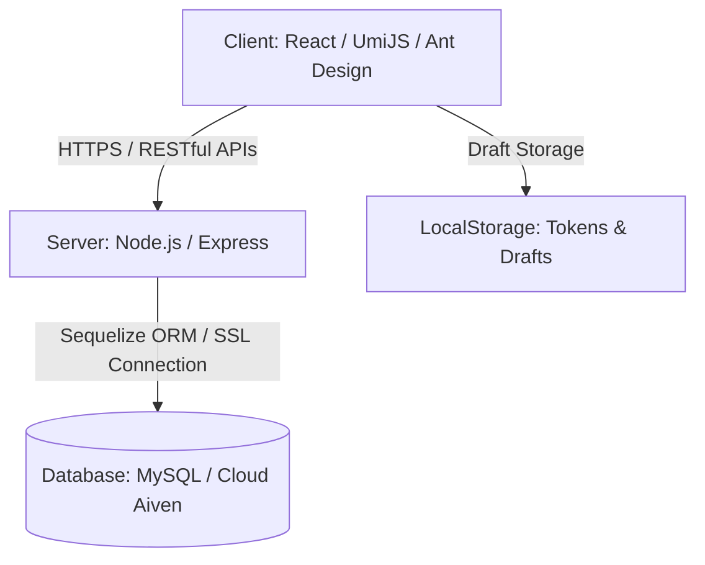
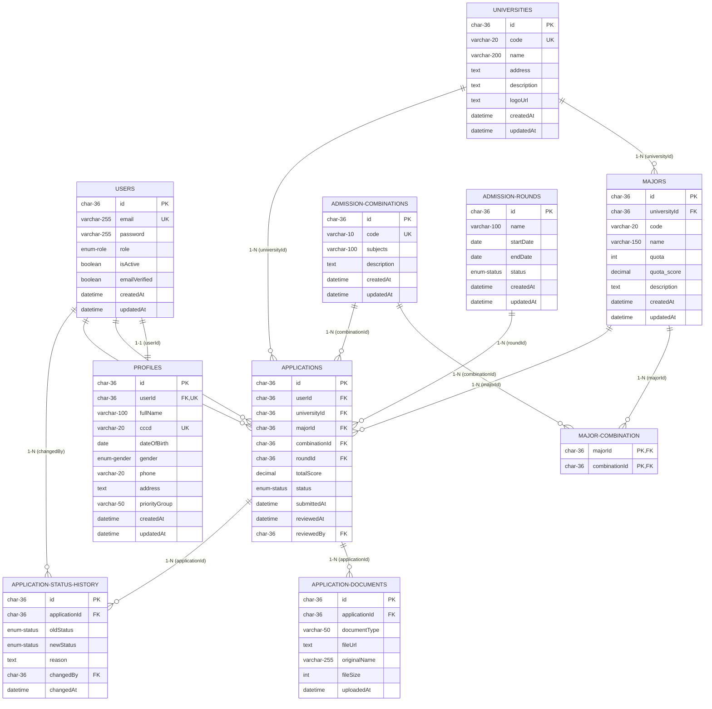

# TÀI LIỆU KIẾN TRÚC & THIẾT KẾ HỆ THỐNG TUYỂN SINH TRỰC TUYẾN (ONLINE ADMISSION)

---

## I. TỔNG QUAN KIẾN TRÚC HỆ THỐNG
Hệ thống được phát triển theo mô hình **Fullstack tách biệt (Client-Server Architecture)** nhằm nâng cao khả năng mở rộng, tối ưu hóa băng thông và bảo mật:



*   **Frontend (Client):** Sử dụng framework **UmiJS (React)** phối hợp cùng **Ant Design v6** cho giao diện hiện đại và thư viện CSS Less. Hỗ trợ định tuyến Single-Page Application (SPA).
*   **Backend (Server):** Sử dụng **Node.js** và framework **Express**. Áp dụng cấu trúc phân tầng (Routes ➡️ Middlewares ➡️ Controllers ➡️ Services ➡️ Repositories ➡️ Models) để code mạch lạc và cô đọng.
*   **Database (Cơ sở dữ liệu):** Cơ sở dữ liệu quan hệ **MySQL** được kết nối thông qua **Sequelize ORM** với tính năng kết nối SSL bắt buộc nhằm tăng tính bảo mật cho dịch vụ đám mây (Aiven Cloud).

---

## II. VAI TRÒ VÀ PHÂN QUYỀN TRONG HỆ THỐNG (ROLES & PERMISSIONS)

Hệ thống phân cấp người dùng dựa trên trường `role` trong bảng `users`:

### 1. Vai trò Thí sinh (`CANDIDATE`)
*   **Trang cá nhân (Profile):** Cập nhật hồ sơ thí sinh (Họ tên, ngày sinh, giới tính, số điện thoại, địa chỉ, CCCD, nhóm đối tượng ưu tiên).
*   **Quản lý bản nháp (Draft Application):** Tự động lưu bản nháp hồ sơ đang điền dở dưới Client thông qua LocalStorage để tránh mất dữ liệu khi rớt mạng hoặc chưa sẵn sàng nộp.
*   **Đăng ký xét tuyển:** Chọn Đợt tuyển sinh, Trường Đại học mong muốn, Ngành học, Tổ hợp môn xét tuyển, nhập tổng điểm xét tuyển và tải tài liệu đính kèm (Ảnh chụp Học bạ THPT, CCCD dạng PDF/Hình ảnh).
*   **Theo dõi hồ sơ:** Xem danh sách các hồ sơ đã nộp và trạng thái xử lý thời gian thực (`Chờ duyệt`, `Được nhận`, `Bị từ chối`). Xem lý do phản hồi chi tiết từ Admin nếu bị từ chối.

### 2. Vai trò Quản trị viên (`ADMIN` / `SUPER ADMIN`)
*   **Bảng điều khiển quản trị (Dashboard):** Xem biểu đồ thống kê tổng quan số lượng hồ sơ theo đợt tuyển sinh, trạng thái phê duyệt và ngành học hot.
*   **Duyệt hồ sơ đăng ký:** Xem danh sách hồ sơ cần duyệt, kiểm tra thông tin đối chiếu và tải xuống file đính kèm (PDF Học bạ/CCCD). Thực hiện **Phê duyệt (Approve)** hoặc **Từ chối (Reject)** hồ sơ kèm lý do phản hồi chi tiết cho thí sinh.
*   **Quản lý danh mục tuyển sinh:** 
    *   Quản lý danh sách các trường Đại học (Mã trường, Tên trường, Địa chỉ, Logo).
    *   Quản lý danh sách Ngành học thuộc từng trường và định mức chỉ tiêu, điểm sàn.
    *   Quản lý Đợt tuyển sinh (Ngày bắt đầu, Ngày kết thúc, Trạng thái đợt).
    *   Quản lý các Tổ hợp môn xét tuyển (A00, A01, D01...).
*   **Quản lý người dùng:** Quản lý thông tin tài khoản và kích hoạt/khóa tài khoản thí sinh.

---

## III. CẤU TRÚC DỮ LIỆU VÀ CÁC KIỂU DỮ LIỆU CHI TIẾT (DATABASE SCHEMA)

Dữ liệu được tổ chức cực kỳ chặt chẽ với sơ đồ thực thể mối quan hệ **ERD (Entity-Relationship Diagram)** mô tả chi tiết các trường, kiểu dữ liệu và mối quan hệ ràng buộc:



### 3. Phân tích chi tiết Mối quan hệ và Ràng buộc ngoại (Foreign Keys)
*   **Quan hệ 1 - 1 (Một - Một):**
    *   `USERS` ➡️ `PROFILES`: Mỗi tài khoản người dùng chỉ có duy nhất một thông tin hồ sơ tương ứng. Liên kết qua trường ngoại `userId` tham chiếu đến `users.id` với ràng buộc `UNIQUE` và quy tắc `ON DELETE CASCADE` (khi xóa tài khoản, hồ sơ cá nhân tự động bị xóa theo).
*   **Quan hệ 1 - N (Một - Nhiều):**
    *   `UNIVERSITIES` ➡️ `MAJORS`: Một trường Đại học có thể mở nhiều Ngành học xét tuyển khác nhau. `majors.universityId` tham chiếu đến `universities.id`. Khi xóa một trường đại học, toàn bộ ngành học của trường đó sẽ tự động bị xóa (`ON DELETE CASCADE`).
    *   `APPLICATIONS` ➡️ `APPLICATION_DOCUMENTS`: Một hồ sơ xét tuyển có thể đính kèm nhiều loại giấy tờ pháp lý (CCCD, Học bạ...). `application_documents.applicationId` tham chiếu đến `applications.id` (`ON DELETE CASCADE`).
    *   `APPLICATIONS` ➡️ `APPLICATION_STATUS_HISTORY`: Một hồ sơ xét tuyển có lịch sử cập nhật trạng thái chi tiết lưu trữ qua các đợt kiểm duyệt. `application_status_history.applicationId` tham chiếu tới `applications.id` (`ON DELETE CASCADE`).
*   **Quan hệ N - N (Nhiều - Nhiều):**
    *   `MAJORS` ➡️ `ADMISSION_COMBINATIONS` thông qua bảng liên kết trung gian `MAJOR_COMBINATION`: Một ngành học có thể xét tuyển bằng nhiều tổ hợp môn học khác nhau (VD: Công nghệ thông tin nhận A00 và A01) và ngược lại, một tổ hợp môn có thể dùng để nộp vào nhiều ngành.
*   **Mối quan hệ liên kết nghiệp vụ cốt lõi (Core Business Joins):**
    *   Bảng `APPLICATIONS` đóng vai trò là "nút giao" kết nối thông tin của 5 thực thể khác nhau: `USERS` (Ai nộp?), `UNIVERSITIES` (Nộp vào trường nào?), `MAJORS` (Ngành nào?), `ADMISSION_COMBINATIONS` (Khối thi gì?), và `ADMISSION_ROUNDS` (Đợt tuyển sinh nào?).
    *   Hành động kiểm duyệt hồ sơ tạo ra mối liên kết phụ: `reviewedBy` trong `APPLICATIONS` và `changedBy` trong `APPLICATION_STATUS_HISTORY` đều trỏ ngược về `users.id` để ghi nhận danh tính của Admin xử lý.


### 1. Bảng `users` (Quản lý tài khoản đăng nhập)
| Trường | Kiểu dữ liệu | Ràng buộc | Mô tả |
| :--- | :--- | :--- | :--- |
| `id` | `CHAR(36)` | `PRIMARY KEY`, Default `UUID()` | Mã định danh duy nhất (UUID) |
| `email` | `VARCHAR(255)` | `UNIQUE`, `NOT NULL` | Địa chỉ email dùng làm tài khoản |
| `password` | `VARCHAR(255)` | `NOT NULL` | Mật khẩu (đã được băm bằng bcryptjs) |
| `role` | `ENUM('CANDIDATE', 'ADMIN')`| Default `'CANDIDATE'` | Phân quyền người dùng |
| `isActive` | `BOOLEAN` | Default `TRUE` | Trạng thái tài khoản (Đang hoạt động / Bị khóa) |
| `emailVerified`| `BOOLEAN` | Default `FALSE` | Trạng thái xác thực email |
| `createdAt` | `DATETIME` | Default `CURRENT_TIMESTAMP` | Thời gian khởi tạo |
| `updatedAt` | `DATETIME` | Tự động cập nhật khi update | Thời gian chỉnh sửa |

### 2. Bảng `profiles` (Thông tin chi tiết của thí sinh)
| Trường | Kiểu dữ liệu | Ràng buộc | Mô tả |
| :--- | :--- | :--- | :--- |
| `id` | `CHAR(36)` | `PRIMARY KEY` | Mã hồ sơ định danh |
| `userId` | `CHAR(36)` | `FOREIGN KEY` -> `users.id`, `UNIQUE` | Liên kết 1-1 với tài khoản |
| `fullName` | `VARCHAR(100)` | `NOT NULL` | Họ và tên |
| `cccd` | `VARCHAR(20)` | `UNIQUE` | Số Căn cước công dân |
| `dateOfBirth` | `DATE` | | Ngày sinh |
| `gender` | `ENUM('Nam', 'Nữ', 'Khác')`| | Giới tính |
| `phone` | `VARCHAR(20)` | | Số điện thoại |
| `address` | `TEXT` | | Địa chỉ cư trú |
| `priorityGroup`| `VARCHAR(50)` | | Nhóm đối tượng ưu tiên (KV1, KV2, KV3...) |

### 3. Bảng `universities` (Thông tin trường Đại học tham gia hệ thống)
| Trường | Kiểu dữ liệu | Ràng buộc | Mô tả |
| :--- | :--- | :--- | :--- |
| `id` | `CHAR(36)` | `PRIMARY KEY` | Mã định danh trường |
| `code` | `VARCHAR(20)` | `UNIQUE`, `NOT NULL` | Ký hiệu mã trường (VD: `BVH`, `BKA`...) |
| `name` | `VARCHAR(200)` | `NOT NULL` | Tên đầy đủ của trường |
| `address` | `TEXT` | | Địa chỉ trụ sở |
| `description` | `TEXT` | | Giới thiệu ngắn về trường |
| `logoUrl` | `TEXT` | | URL chứa ảnh Logo trường |

### 4. Bảng `majors` (Thông tin ngành học)
| Trường | Kiểu dữ liệu | Ràng buộc | Mô tả |
| :--- | :--- | :--- | :--- |
| `id` | `CHAR(36)` | `PRIMARY KEY` | Mã định danh ngành |
| `universityId` | `CHAR(36)` | `FOREIGN KEY` -> `universities.id` | Trực thuộc trường đại học nào |
| `code` | `VARCHAR(20)` | `NOT NULL` | Mã ngành xét tuyển (VD: `7480201`) |
| `name` | `VARCHAR(150)` | `NOT NULL` | Tên ngành học |
| `quota` | `INT` | | Chỉ tiêu tuyển sinh |
| `minScore` | `DECIMAL(4,2)` | | Điểm sàn tối thiểu nhận hồ sơ |
| `description` | `TEXT` | | Thông tin mô tả ngành học |
| *Ràng buộc bổ sung:* Duy nhất cặp (`universityId`, `code`) để tránh trùng mã ngành trong cùng một trường.

### 5. Bảng `admission_combinations` (Danh mục tổ hợp môn)
| Trường | Kiểu dữ liệu | Ràng buộc | Mô tả |
| :--- | :--- | :--- | :--- |
| `id` | `CHAR(36)` | `PRIMARY KEY` | Mã định danh tổ hợp |
| `code` | `VARCHAR(10)` | `UNIQUE`, `NOT NULL` | Mã tổ hợp môn (VD: `A00`, `A01`...) |
| `subjects` | `VARCHAR(100)` | | Các môn thành phần (VD: Toán, Lý, Hóa) |
| `description` | `TEXT` | | Mô tả thêm |

### 6. Bảng `major_combination` (Bảng trung gian liên kết Nhiều-Nhiều giữa Ngành và Tổ hợp)
| Trường | Kiểu dữ liệu | Ràng buộc | Mô tả |
| :--- | :--- | :--- | :--- |
| `majorId` | `CHAR(36)` | `PRIMARY KEY`, `FOREIGN KEY` -> `majors.id` | Khóa chính ghép phần 1 |
| `combinationId`| `CHAR(36)` | `PRIMARY KEY`, `FOREIGN KEY` -> `combinations.id` | Khóa chính ghép phần 2 |

### 7. Bảng `admission_rounds` (Quản lý các đợt tuyển sinh)
| Trường | Kiểu dữ liệu | Ràng buộc | Mô tả |
| :--- | :--- | :--- | :--- |
| `id` | `CHAR(36)` | `PRIMARY KEY` | Mã đợt tuyển sinh |
| `name` | `VARCHAR(100)` | `NOT NULL` | Tên đợt (VD: Học bạ Đợt 1, Tốt nghiệp THPT...) |
| `startDate` | `DATE` | `NOT NULL` | Ngày mở cổng đăng ký |
| `endDate` | `DATE` | `NOT NULL` | Ngày đóng cổng đăng ký |
| `status` | `ENUM('upcoming', 'ongoing', 'ended')`| Default `'upcoming'` | Trạng thái (Sắp diễn ra, Đang diễn ra, Đã đóng) |

### 8. Bảng `applications` (Hồ sơ đăng ký xét tuyển của thí sinh - Bảng Nghiệp vụ Core)
| Trường | Kiểu dữ liệu | Ràng buộc | Mô tả |
| :--- | :--- | :--- | :--- |
| `id` | `CHAR(36)` | `PRIMARY KEY` | Mã hồ sơ đăng ký |
| `userId` | `CHAR(36)` | `FOREIGN KEY` -> `users.id` | Thí sinh nộp hồ sơ |
| `universityId` | `CHAR(36)` | `FOREIGN KEY` -> `universities.id` | Trường đăng ký xét tuyển |
| `majorId` | `CHAR(36)` | `FOREIGN KEY` -> `majors.id` | Ngành học đăng ký |
| `combinationId`| `CHAR(36)` | `FOREIGN KEY` -> `admission_combinations.id` | Tổ hợp môn lựa chọn |
| `roundId` | `CHAR(36)` | `FOREIGN KEY` -> `admission_rounds.id` | Thuộc đợt tuyển sinh nào |
| `totalScore` | `DECIMAL(5,2)` | | Điểm thi của thí sinh dựa theo tổ hợp |
| `status` | `ENUM('pending', 'approved', 'rejected')`| Default `'pending'` | Trạng thái hồ sơ (`Chờ duyệt`, `Đã nhận`, `Bị từ chối`) |
| `submittedAt` | `DATETIME` | Default `CURRENT_TIMESTAMP` | Ngày giờ nộp hồ sơ |
| `reviewedAt` | `DATETIME` | | Ngày giờ kiểm duyệt |
| `reviewedBy` | `CHAR(36)` | `FOREIGN KEY` -> `users.id` | Admin phụ trách duyệt hồ sơ |
| *Ràng buộc bổ sung:* Duy nhất bộ ba (`userId`, `roundId`, `majorId`) để đảm bảo trong một đợt tuyển sinh thí sinh không thể nộp hai hồ sơ giống hệt nhau vào cùng một ngành của một trường.

### 9. Bảng `application_documents` (Tệp tài liệu đính kèm)
| Trường | Kiểu dữ liệu | Ràng buộc | Mô tả |
| :--- | :--- | :--- | :--- |
| `id` | `CHAR(36)` | `PRIMARY KEY` | Mã định danh file |
| `applicationId`| `CHAR(36)` | `FOREIGN KEY` -> `applications.id` | Đính kèm vào hồ sơ nào |
| `documentType` | `VARCHAR(50)` | `NOT NULL` | Loại giấy tờ (VD: `HOC_BA`, `CCCD`) |
| `fileUrl` | `TEXT` | `NOT NULL` | URL đường dẫn file trên Server/Cloud Storage |
| `originalName` | `VARCHAR(255)` | | Tên gốc của file khi upload lên |
| `fileSize` | `INT` | | Dung lượng file (bytes) |
| `uploadedAt` | `DATETIME` | Default `CURRENT_TIMESTAMP` | Ngày giờ tải lên |

### 10. Bảng `application_status_history` (Lịch sử cập nhật trạng thái - Phục vụ Audit Trail)
| Trường | Kiểu dữ liệu | Ràng buộc | Mô tả |
| :--- | :--- | :--- | :--- |
| `id` | `CHAR(36)` | `PRIMARY KEY` | Mã lịch sử thay đổi |
| `applicationId`| `CHAR(36)` | `FOREIGN KEY` -> `applications.id` | Liên kết hồ sơ thay đổi |
| `oldStatus` | `ENUM('pending', 'approved', 'rejected')`| | Trạng thái trước khi đổi |
| `newStatus` | `ENUM('pending', 'approved', 'rejected')`| `NOT NULL` | Trạng thái sau khi đổi |
| `reason` | `TEXT` | | Lý do duyệt/từ chối của quản trị viên |
| `changedBy` | `CHAR(36)` | `FOREIGN KEY` -> `users.id` | Admin thực hiện thay đổi |
| `changedAt` | `DATETIME` | Default `CURRENT_TIMESTAMP` | Ngày giờ thay đổi |

---

## IV. CÁC LUỒNG NGHIỆP VỤ CHÍNH TRONG HỆ THỐNG

### 1. Luồng Xác thực & Đăng nhập (Auth Flow)
*   **Đăng ký tài khoản:** Mật khẩu thí sinh nhập vào được gửi lên Server, sử dụng thư viện `bcryptjs` để băm thành hash an toàn trước khi lưu vào CSDL.
*   **Phân loại lỗi đăng nhập đặc biệt:**
    *   Nếu tài khoản đúng nhưng trường `isActive = false` ➡️ Backend lập tức ném ra lỗi **HTTP 403 Forbidden** kèm thông báo `"Tài khoản của bạn đã bị khóa"`. Phía Client nhận diện mã 403 này để hiển thị thông báo khẩn cấp màu đỏ nổi bật kéo dài 6 giây nhằm định hướng thí sinh liên hệ Admin.
    *   Nếu thông tin nhập sai hoặc email không tồn tại ➡️ Backend ném lỗi **HTTP 401 Unauthorized** để báo lỗi thông thường ("Tài khoản hoặc mật khẩu không chính xác").

### 2. Luồng Nộp Hồ sơ Xét tuyển (Application Submission Flow)
*   **Bước 1:** Thí sinh điền thông tin cá nhân.
*   **Bước 2:** Hệ thống lưu tự động vào `LocalStorage` dưới Key `candidate_application_draft` mỗi khi thí sinh chỉnh sửa để tránh mất dữ liệu.
*   **Bước 3:** Thí sinh chọn Trường ➡️ Tải danh sách Ngành tương ứng ➡️ Chọn Tổ hợp thi phù hợp đã được cấu hình liên kết Nhiều-Nhiều.
*   **Bước 4:** Thí sinh tải lên file tài liệu đính kèm (Học bạ, CCCD). Hệ thống thông qua `Multer middleware` để phân loại, đổi tên file an toàn và lưu vào thư mục `uploads/` trên server (hoặc cloud).
*   **Bước 5:** Bấm nộp. Hồ sơ được lưu vào bảng `applications` và các tệp đính kèm được ghi nhận vào bảng `application_documents` với trạng thái mặc định ban đầu là `pending` (Chờ duyệt). Bản nháp `candidate_application_draft` trong LocalStorage được dọn dẹp sạch sẽ.

### 3. Luồng Kiểm duyệt Hồ sơ (Admin Review Flow)
*   **Bước 1:** Admin duyệt danh sách hồ sơ có trạng thái `pending`.
*   **Bước 2:** Admin nhấp xem chi tiết hồ sơ ➡️ Xem được thông tin học sinh, điểm số, và click trực tiếp để xem/kiểm chứng file PDF Học bạ/CCCD.
*   **Bước 3:**
    *   *Trường hợp Đạt yêu cầu:* Bấm **Duyệt**. Trạng thái chuyển thành `approved`.
    *   *Trường hợp Không đạt:* Bấm **Từ chối** và điền lý do chi tiết (Ví dụ: "Học bạ bị mờ trang 2", "Điểm số không trùng khớp"). Trạng thái chuyển thành `rejected`.
*   **Bước 4:** Hệ thống tự động ghi nhận một bản ghi log trạng thái vào bảng `application_status_history` để làm lịch sử theo dõi. Đồng thời gửi một email tự động tới thí sinh thông qua dịch vụ `Nnodemailer SMTP` thông báo kết quả duyệt hồ sơ.

---

## V. CÁC TỐI ƯU CẬP NHẬT CẬN KỀ MỚI NHẤT
1.  **Home Page Premium UX:** Nền slide ảnh động chuyển đổi mỗi 3 giây, bỏ ảnh laptop cũ lỗi thời. Bổ sung 2 bảng tin Tĩnh thiết kế cực đẹp cho "Thông báo" và "Văn bản" ở trang chủ để làm tăng độ uy tín, chân thật cho cổng tuyển sinh.
2.  **Dọn dẹp bảo mật tuyệt đối:** Xóa sạch toàn bộ console log in thông tin mật khẩu thô và chuỗi mã hóa bcrypt trên Terminal để tuân thủ tiêu chuẩn an toàn bảo mật OWASP.
3.  **Xóa sạch dấu vết phiên cũ khi Logout:** Khi người dùng click "Đăng xuất" hoặc "Thoát", hệ thống tự động xóa sạch `token`, `refreshToken`, `user` và cả bản nháp hồ sơ `candidate_application_draft` khỏi LocalStorage để tránh lộ thông tin trên các thiết bị dùng chung.
4.  **Tối ưu hóa Server:** Loại bỏ hoàn toàn các dòng ghi chú, bình luận dư thừa giúp server chạy với hiệu suất cao hơn và code trở nên cực kỳ chuyên nghiệp (Production-ready).
5.  **Cấu hình deploy Cloud tối ưu:** Hợp nhất các cấu hình trùng lặp trong config database, tự động kích hoạt chế độ kết nối MySQL bảo mật thông qua SSL để tương thích hoàn toàn với nhà cung cấp cơ sở dữ liệu Aiven Cloud và hosting Render.

---

## VI. CẤU TRÚC THƯ MỤC DỰ ÁN (PROJECT DIRECTORY STRUCTURE)

Dự án được cấu trúc theo dạng Monorepo tách biệt rõ ràng Frontend và Backend:

```text
TH_LapTrinhWeb/
├── client/                     # FRONTEND (UmiJS / React)
│   ├── config/                 # Cấu hình dự án (routes, proxy, config.ts)
│   ├── public/                 # Static files (Chứa file _redirects của Netlify)
│   ├── src/
│   │   ├── layouts/            # Giao diện chung (AdminLayout, CandidateLayout)
│   │   ├── pages/              # Trang ứng dụng (Auth, Admin, Candidate, Home)
│   │   │   ├── Auth/           # Đăng nhập, Đăng ký
│   │   │   ├── Admin/          # Quản lý ngành, đợt, duyệt hồ sơ
│   │   │   ├── Candidate/      # Dashboard thí sinh, điền hồ sơ, Profile
│   │   │   └── index.tsx       # Landing page (Trang chủ chính)
│   │   ├── services/           # Gọi APIs (axios client, request.ts)
│   │   ├── utils/              # Các hàm tiện ích (Bản nháp hồ sơ...)
│   │   └── app.tsx             # Điểm khởi chạy cấu hình chạy Client
│   └── package.json            # Thư viện Frontend (Ant Design, Axios, UmiJS)
│
└── server/                     # BACKEND (Node.js / Express)
    ├── database/               # File SQL Schema và Dữ liệu mẫu (Seed)
    ├── src/
    │   ├── configs/            # Cấu hình Database, JWT, Mail, Multer Upload
    │   ├── controllers/        # Điều hướng xử lý request từ Client
    │   ├── middlewares/        # Bộ lọc kiểm soát (Auth, Phân quyền, Báo lỗi)
    │   ├── models/             # Định nghĩa cấu trúc bảng (Sequelize Models)
    │   ├── repositories/       # Tầng tương tác trực tiếp với Database
    │   ├── routes/             # Định nghĩa cổng mạng Router APIs
    │   ├── seeders/            # File sequelize tự động chèn dữ liệu mẫu
    │   ├── services/           # Xử lý Logic nghiệp vụ cốt lõi
    │   ├── utils/              # Tiện ích chung (Format Response, Logger...)
    │   └── server.js           # Điểm khởi chạy Server Express
    └── package.json            # Thư viện Backend (Sequelize, Express, Bcryptjs)
```

---

## VII. DANH SÁCH CÁC API ENDPOINTS CHÍNH (CORE API LIST)

Backend cung cấp hệ thống RESTful API hoàn chỉnh với tiền tố chung `/api`:

### 1. Nhóm Xác thực (`/api/auth`)
*   `POST /api/auth/register` ➡️ Đăng ký tài khoản thí sinh mới.
*   `POST /api/auth/login` ➡️ Đăng nhập (Trả về `accessToken`, `refreshToken` và `user` profile).
*   `POST /api/auth/refresh` ➡️ Làm mới Token phiên đăng nhập khi hết hạn.

### 2. Nhóm Hồ sơ xét tuyển (`/api/applications`)
*   `POST /api/applications` ➡️ Thí sinh nộp hồ sơ xét tuyển mới.
*   `GET /api/applications` ➡️ Thí sinh xem danh sách hồ sơ của mình / Admin xem toàn bộ hồ sơ.
*   `GET /api/applications/:id` ➡️ Xem chi tiết một hồ sơ xét tuyển kèm các file tài liệu.
*   `PUT /api/applications/:id/review` ➡️ (Admin) Duyệt hoặc từ chối hồ sơ kèm lý do.

### 3. Nhóm Tiện ích & Upload (`/api/upload`)
*   `POST /api/upload` ➡️ Tải lên tệp tài liệu (Học bạ, CCCD), trả về URL file lưu trữ.

### 4. Nhóm Danh mục Trường & Ngành học (`/api/universities`, `/api/majors`)
*   `GET /api/universities` ➡️ Lấy danh sách các trường Đại học có trên hệ thống.
*   `GET /api/majors` ➡️ Lấy danh sách ngành học (Có thể lọc theo trường đại học `?universityId=xxx`).

### 5. Nhóm Đợt tuyển sinh & Tổ hợp môn (`/api/admission-rounds`, `/api/admission-combinations`)
*   `GET /api/admission-rounds` ➡️ Lấy danh sách các đợt tuyển sinh đang mở.
*   `GET /api/admission-combinations` ➡️ Lấy danh mục tổ hợp xét tuyển (A00, A01, D01...).

---

## VIII. CÔNG NGHỆ VÀ PHIÊN BẢN SỬ DỤNG (TECHNOLOGY STACK)

| Môi trường | Công nghệ | Phiên bản | Mô tả chức năng |
| :--- | :--- | :--- | :--- |
| **Frontend** | UmiJS | `^4.6.51` | Framework chính điều hướng và render SPA |
| | Ant Design | `^6.3.7` | Bộ giao diện người dùng (UI Components) |
| | Axios | `^1.16.0` | Thư viện kết nối và gửi request lên API |
| **Backend** | Node.js | `v18+` / `v20+`| Môi trường thực thi Javascript phía Server |
| | Express | `^5.2.1` | Framework xây dựng RESTful APIs |
| | Sequelize | `^6.37.8` | Thư viện ORM tương tác an toàn với database |
| | MySQL2 | `^3.22.3` | Trình điều khiển (driver) kết nối MySQL |
| | Bcryptjs | `^3.0.3` | Thư viện băm bảo mật mật khẩu |
| | Jsonwebtoken| `^9.0.3` | Quản lý mã hóa Token đăng nhập (JWT) |
| | Nodemailer | `^8.0.7` | Gửi Email thông báo tự động |
| | Multer | `^2.1.1` | Xử lý tải lên các tệp tài liệu |

---

## IX. CƠ CHẾ BẢO MẬT VÀ VALIDATION (SECURITY & VALIDATION)

Hệ thống được thiết kế theo các tiêu chuẩn bảo mật hiện đại nhằm ngăn chặn các lỗ hổng tấn công phổ biến:

1.  **Xác thực không trạng thái (Stateless Authentication):** 
    Sử dụng **JWT (JSON Web Token)** với cơ chế gồm 2 mã: `accessToken` (thời hạn ngắn) và `refreshToken` (thời hạn dài để tự động lấy token mới), đảm bảo không cần lưu session trên server để giảm tải RAM.
2.  **Mã hóa một chiều (Password Hashing):**
    Toàn bộ mật khẩu người dùng được băm bằng thuật toán **Bcrypt** với `saltRounds = 10` trước khi lưu vào database, chống lại các cuộc tấn công rò rỉ cơ sở dữ liệu.
3.  **Lọc dữ liệu đầu vào (Input Validation):**
    Áp dụng Middleware kiểm duyệt dữ liệu thông qua thư viện **Joi** và **Joi-validator** trước khi dữ liệu đi vào Controller xử lý, ngăn chặn hoàn toàn tấn công SQL Injection và lỗi định dạng dữ liệu đầu vào.
4.  **Bảo vệ kết nối dữ liệu (SSL Connection):**
    Cấu hình database production bắt buộc sử dụng **SSL (`rejectUnauthorized: false`)** để đảm bảo dữ liệu di chuyển giữa Backend (Render) và Database Cloud (Aiven) luôn được mã hóa đường truyền.
5.  **Ngăn chặn rò rỉ phiên (Session Privacy):**
    Cơ chế Logout ở Client tự động dọn sạch mọi LocalStorage (tokens, user profile, draft data) để ngăn chặn kẻ xấu có thể đánh cắp phiên làm việc trên các máy tính công cộng.
